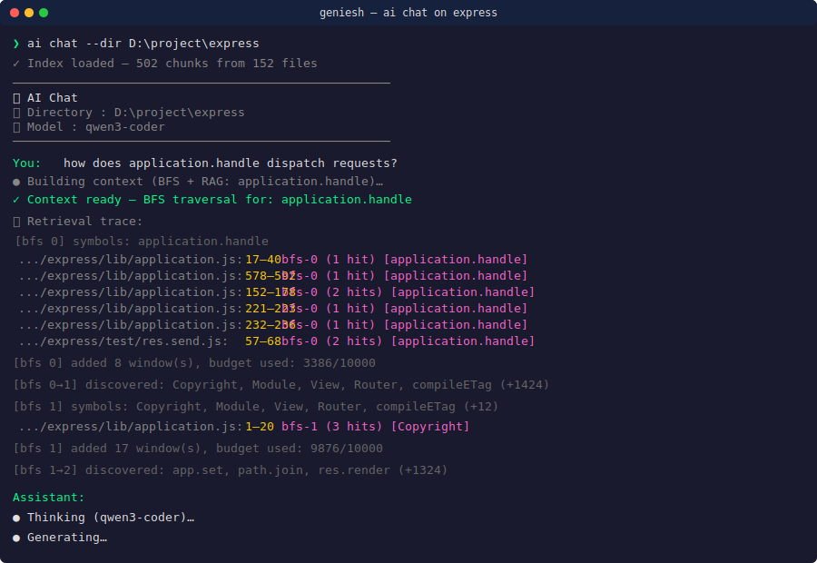
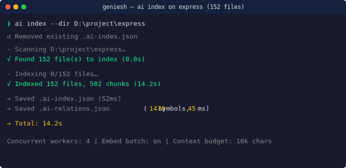
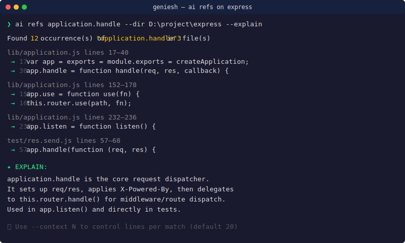

# geniesh

A local AI developer assistant powered by **qwen3-coder** with a **RAG (Retrieval-Augmented Generation)** pipeline and **BFS relation-graph traversal**. Runs entirely on your machine — no API keys, no data leaving your system.

## Requirements

- Node.js 18+
- [Ollama](https://ollama.com) running locally
- `ollama serve` -> to run locally

## Installation

```bash
# 1. Install dependencies
npm install

# 2. Pull required Ollama models (minimum)
ollama pull nomic-embed-text
ollama pull qwen3-coder

# Alternative embedders (optional — swap via --embedder)
# ollama pull mxbai-embed-large
# ollama pull snowflake-arctic-embed2

# 3. Link globally so `geniesh` works anywhere (run from the project directory)
cd /path/to/geniesh && npm link

# Or run without linking, using node directly:
# node src/cli.js chat
```

## Quickstart

The fastest way to get answers about any codebase:

```bash
# cd into any project and start chatting — auto-indexes on first use
geniesh chat

# Ask about specific files — geniesh loads them as full context
#   "what does the render function in lib/application.js do?"
#   "find the bug in src/auth.js around line 42"
#   "how does Router.handle dispatch requests?"

# Or use one-shot queries for quick analysis
geniesh "are there any security issues?" --file src/auth.js
geniesh refs validateToken --dir src/ --explain
```

That's it. No config files, no API keys, no data leaving your machine.

## Commands

### `geniesh index --dir <path>`

Scans a directory, chunks all source files, generates embeddings, builds a **symbol relation graph**, and saves both `.ai-index.json` and `.ai-relations.json`. Run this once before using `geniesh chat`.

```bash
geniesh index --dir src/
geniesh index --dir .

# Use a different embedding model
geniesh --embedder mxbai-embed-large index --dir .
```

Files in `node_modules`, `dist`, `.git`, `build`, `coverage`, and hidden directories are automatically ignored.

---

### `geniesh "<query>" --file <path>`

Reads a file and sends it directly to the LLM.

```bash
geniesh "find bugs" --file src/auth.ts
geniesh "are there any security issues?" --file src/api/routes.js
```

---

### `geniesh "<query>" --file <path> --fn <function-name>`

Extracts a single named function from a file and analyzes only that function.

```bash
geniesh "explain this function" --fn login --file src/auth.ts
geniesh "find edge cases" --fn validateToken --file src/middleware.js
```

Supports function declarations, arrow functions, async functions, and class methods.

---

### `geniesh "<query>" --dir <path>`

Uses the RAG index to retrieve the most relevant code chunks for the query, then sends only those chunks to the LLM. **Requires running `geniesh index` first.** (Does not use the relation graph — use `geniesh chat` for BFS traversal.)

```bash
geniesh "how does authentication work?" --dir src/
geniesh "where are database queries made?" --dir .
geniesh "find potential memory leaks" --dir src/
```

The top 5 most semantically similar chunks (by cosine similarity) are retrieved and used as context.

---

### `geniesh chat`

Starts an intelligent multi-turn chat session with auto-indexing, **BFS relation-graph traversal**, **auto-detected file references**, and RAG augmentation.

```bash
geniesh chat
geniesh chat --dir /path/to/project
geniesh chat --model qwen3-coder
geniesh --embedder mxbai-embed-large chat --model llama3.1
```

If no `.ai-index.json` exists in the current directory, the index is built automatically before the session starts.

**How context is built per turn:**

Each message triggers a two-tier context pipeline:

1. **BFS relation-graph traversal (budget-limited)**  
   Code symbols are extracted from your question (`camelCase`, `PascalCase`, `snake_case`, `ALL_CAPS`, `dotted.paths`). These seed a breadth-first search over a pre-built **symbol relation graph** (`.ai-relations.json`) that maps every symbol to the files it appears in and every file to the symbols it contains. Each symbol carries **metadata** — its kind (`class`, `function`, `variable`, `reference`), whether it's **exported**, and its **line range** in the source file. At each round, symbols are grepped to retrieve code windows, and the relation graph reveals new symbols from the same files — no re-grepping needed. New symbols are sorted by priority: exported symbols first, then class > function > variable > reference. The BFS continues until the 10,000-character context budget is exhausted (frontier capped at 20 symbols per round). If the question has no code symbols, the BFS is seeded from the top RAG chunks instead.

2. **RAG (remaining budget)**  
   Cosine similarity search fills any remaining context budget, with README and `.md` files prioritised.

During context building, the BFS log is printed in grey:
```
  [bfs 0] symbols: methodName, itemTypeUtil
  [bfs 0] added 3 window(s), budget used: 4120/10000
  [bfs 0→1] discovered: piq, apiResponse, integrationId (+2 more)
  [bfs 1] symbols: piq, apiResponse, integrationId
  [bfs 1] added 2 window(s), budget used: 7340/10000
```

```
You: how does methodName work?
Assistant: ...

You: exit
```

Type `exit` or press `Ctrl+C` to quit.

---

### `geniesh refs <name> --dir <path>`

Finds all usages of a symbol (function calls, definitions, imports) across a directory using word-boundary matching. **No index required** — runs in milliseconds directly on the source files.

```bash
geniesh refs login --dir src/
geniesh refs validateToken --dir .
```

Optionally ask the LLM a question about all the found usages:

```bash
geniesh refs login --dir src/ --ask "are there any security issues with how login is called?"
geniesh refs db.query --dir src/ --ask "could any of these queries be vulnerable to injection?"
```

Or use `--explain` for a one-shot summary of what the symbol does and how it is used across the codebase:

```bash
geniesh refs login --dir src/ --explain
geniesh refs fetchUser --dir src/ --explain
```

Control how many lines of surrounding context are captured per match (default 20):

```bash
geniesh refs fetchUser --dir src/ --context 10
```

Use this instead of `--dir` RAG when you want to find **where** something is called, defined, or imported — structural questions RAG is not suited for.

---

## Showcase

> Real terminal screenshots generated from actual sessions on Express 5.x (152 files, 502 chunks, 1470 symbols).

### `geniesh chat` on a large open-source codebase

*BFS traversal discovers `application.handle`, then `Router`, `View`, `compileETag` across 3 rounds. Source files from `lib/` fill budget before test files.*



### `geniesh index` — indexing a real-world project



*152 files indexed in 14.2s with concurrent workers (4) and per-file embed batching.*

### `geniesh refs` — find all usages of a symbol



*`geniesh refs application.handle --explain` — 12 occurrences across 3 files with a concise summary.*

### Video walkthrough

<!-- TODO: Replace with a real screen recording link -->
<!-- ▶️ Watch demo on YouTube -->

---

## Architecture

geniesh separates **LLM-provider-specific code** from **pure code-navigation logic**.
Swap Ollama for OpenAI — swap only the adapter; the kernel never changes.

### One flow, two responsibilities

```
User: "how does tryAdd work?"
            │
            ▼
┌───────────────────────────────────┐
│         ADAPTER LAYER             │  embedder.js → Ollama nomic-embed-text
│  (LLM-provider-specific)          │       │
│                                  │  embed(question) → [0.1, 0.4, …]
│  src/search.js   ← injects →     │       │
│  src/embedder.js  search() dep   │  search(index, embedding) → top-K chunks
│  src/runner.js                   │       │
│  src/prompt.js                   │  ← scored chunks + question
│                                  │       │
│  cli.js orchestrates:            │       │
│   1. build/load index            │       │
│   2. inject search() into kernel │       ▼
│   3. stream LLM response    ─────┼──  contextString + trace  ──┐
└──────────────────────────────────┘                            │
            │ scored chunks (plain data, no embeddings)          │
            ▼                                                    │
┌───────────────────────────────────┐                            │
│         KERNEL LAYER              │  (same layer, no arrows)   │
│  (pure Node, no LLM deps)         │                            │
│                                  │                            │
│  packages/kernel/                │                            │
│  ├── context-builder.js  ←───────┘                            │
│  │   BFS traversal:              │                            │
│  │   seed symbols → grep →       │                            │
│  │   follow relations + import   │                            │
│  │   edges → fill budget;        │                            │
│  │   remaining budget → RAG      │                            │
│  │   (via injected search())     │                            │
│  ├── grep.js          (scope-    │                            │
│  │   aware word-boundary grep)   │                            │
│  ├── relations.js     (symbol→   │                            │
│  │   file + file→symbol maps,    │                            │
│  │   import edges)               │                            │
│  ├── symbol-utils.js  (extract   │                            │
│  │   camelCase/PascalCase/       │                            │
│  │   snake_case symbols)         │                            │
│  ├── chunker.js       (indexing  │                            │
│  │   only; line-based 100/50)    │                            │
│  └── fs-utils.js      (scan +    │                            │
│      read files, skip .min/.git) │                            │
│                                  │                            │
│  Output:                         │                            │
│  ├── contextString (concatenated │                            │
│  │   code sections with labels)  │                            │
│  └── trace (what was retrieved   │                            │
│      and why, per round)         │                            │
└──────────────────────────────────┘                            │
            │                                                    │
            │ contextString                                      │
            ▼                                                    │
┌───────────────────────────────────┐                            │
│         ADAPTER LAYER             │◄───────────────────────────┘
│  (LLM chat)                       │
│                                  │
│  runner.js → Ollama qwen3-coder  │
│  prompt = system + contextString │
│           + question             │
│  stream: "tryAdd is a helper…"   │
└───────────────────────────────────┘
            │ answer
            ▼
         stdout
```

### What goes where

| Concern | Module | Layer |
|---------|--------|-------|
| Embed query text → vector | `embedder.js` | Adapter |
| Cosine-similarity search over index | `search.js` | Adapter¹ |
| LLM prompt templates | `prompt.js` | Adapter |
| Stream LLM response | `runner.js` | Adapter |
| CLI orchestration | `cli.js` | Adapter |
| Directory scanning, file reading | `fs-utils.js` | Kernel |
| Symbol extraction (camelCase etc.) | `symbol-utils.js` | Kernel |
| Word-boundary grep + scope windows | `grep.js` | Kernel |
| Relation graph (symbol/file/import maps) | `relations.js` | Kernel |
| Line-based code chunking (100/50) | `chunker.js` | Kernel |
| BFS traversal + budget + RAG merge | `context-builder.js` | Kernel |

¹ *search() calls embedder.js, so it's adapter-side. The algorithm (cosine similarity) is trivial — it lives in the adapter only because calling embed() is provider-specific. If embeddings are passed in, search could move to kernel.*

## How It Works

geniesh is split into two layers:

**`@geniesh/kernel`** (`packages/kernel/`) — the pure code navigation engine.
Zero LLM dependencies. Can be imported by any tool (n8n, OpenCLAW, agent
workers) without Ollama or a CLI.

```
Indexing pipeline:
  scan dir → skip .min.js/.min.css → chunk (100 lines, 50-line overlap)
            → embed each chunk (nomic-embed-text, truncated to 6000 chars)
            → save to .ai-index.json
            → build relation graph with symbol metadata (kind, exported, lineRange)
              + import edges (byImports / byImporters)
            → incremental merge: only re-scan files whose hash (mtime+size) changed
            → prune stale symbols and files → save to .ai-relations.json

Chat context pipeline (per turn):
  extract symbols from question (camelCase/PascalCase/snake_case/ALL_CAPS/dotted)
    → seed BFS from question symbols (or top RAG chunks if none found)
    → for each round: grep symbols → retrieve code windows
    → discover new symbols via pre-built relation graph (no re-grepping)
      + import-edge traversal (byImports / byImporters)
    → prioritize: query relevance (1e6) > exported (1e5) > kind (1e3)
    → repeat until budget exhausted (frontier ≤ 20, per-file cap 50%)
    → fill remaining budget with RAG (cosine similarity, MD files first)
    → inject as context prefix to LLM message

Query pipeline (--dir mode):
  embed query → cosine similarity over index
              → retrieve top 5 chunks
              → build prompt with retrieved code
              → stream response (buffered, typewriter output)
```

The LLM never reads files directly — all filesystem access happens in the kernel.
The `search()` function is injected as a dependency so you can swap Ollama for
OpenAI, sentence-transformers, or a null fallback (grep-only BFS).

## Project Structure

```
@geniesh/kernel (packages/kernel/)     ← no LLM deps, pure Node
├── src/
│   ├── index.js              Barrel exports
│   ├── fs-utils.js           Directory scanning, file reading
│   ├── symbol-utils.js       Symbol extraction (camelCase, PascalCase, etc.)
│   ├── grep.js               Word-boundary grep with scope windows
│   ├── relations.js          Relation graph builder + import-edge extraction
│   ├── chunker.js            Line-based code chunking
│   └── context-builder.js    BFS traversal + budgeted retrieval + RAG merge
│                              (accepts search() as dependency injection)
└── package.json

geniesh CLI (src/)
├── cli.js              Entry point — all commands (injects search() into kernel)
├── prompt.js           Prompt templates
├── runner.js           Streaming Ollama LLM calls
├── embedder.js         Ollama nomic-embed-text embedding
├── search.js           Adapter: embed query → cosine similarity over index
├── indexer.js          Full indexing pipeline (kernel + embedder + persistence)
├── extractor.js        Named function extraction
├── grep.js             Re-exports kernel grep + formatting helpers
├── context-builder.js  Re-exports kernel context builder
├── relations.js        Re-exports kernel relations + persistence helpers
├── fs-utils.js         Re-exports kernel fs + extractFileRefs
├── symbol-utils.js     Re-exports kernel symbol utils
├── chunker.js          Re-exports kernel chunker
├── md-parser.js        Markdown formatting
└── spinners-ora.js     Terminal spinner animations
```

## The Alchemy Behind This

> *How a human wrestled a chorus of AI ghosts into writing a tool that writes code.*

This project wasn't designed. It was **evolved** — through a chaotic, recursive loop of:

- **AI hallucination roulette** — Copilot, Claude, Llama, and geniesh itself all took the wheel at different points. Each one confidently generated wrong code in its own unique way. The secret? Let them all hallucinate, then pick the pieces that don't burst into flames.

- **Self-improvement agents feeding on themselves** — geniesh was used to debug its own source code. The tool wrote parts of itself, then we asked it to find bugs in what it wrote. It found them. We fixed them. It wrote tests. We ran them. The snake ate its tail and grew scales.

- **Test, test, test** — 106 tests and counting. Every change, no matter how small, runs the gauntlet. If the tests pass, the change survives. If they don't, it gets fed back to the model with the error message. Repeat until green.

- **Manual error archaeology** — For every clean commit you see, there were 10 dirty ones that got squashed. The workflow: generate → break → read the stack trace → curse → fix → repeat. Six years of professional debugging instinct plus an embarrassing amount of classical philosophy (Stoic shrug at failed builds, Hegelian dialectic of thesis → AI hallucination → synthesis).

The result is a tool that works, but more importantly, a process that *improves itself*. geniesh is not a finished product — it's a method for turning AI noise into signal through relentless empirical validation.

If you want to contribute, don't write code. Write tests. Then make them pass.

---

## Notes

- `.ai-index.json` and `.ai-relations.json` are excluded from git by default.
- The `.ai-relations.json` graph persists across sessions. Re-running `geniesh index` performs an **incremental merge** — only files whose content changed (detected by mtime+size hash) are re-scanned, and stale symbols are pruned. A fresh build happens when no previous graph exists.
- Ollama must be running (`ollama serve`) before using any command.
- Context budget is capped at 10,000 characters per turn.
- Minified files (`.min.js`, `.min.css`) are automatically skipped during indexing.
- The relation graph uses `Object.hasOwn()` for map-entry checks to avoid Object.prototype property collisions (e.g. `toString`, `constructor`).
